# Wake Word Always-Listening Mode

## Overview

Your Jarvis AI Website now includes an **Always-Listening Mode** with wake word detection that continuously monitors for the wake word "Jarvis" and automatically processes voice commands. This provides a hands-free, natural interaction experience similar to smart speakers.

## Features

### 🎤 Wake Word Detection
- **Continuous Listening**: Always monitors audio for wake words
- **Multiple Wake Phrases**: Supports user‑configurable phrases (default includes "jarvis", "hey jarvis", "okay jarvis"). Add up to 8 in Settings → Wake Word.
- **Chime on Wake (optional)**: Play a sound when the wake word is recognized. Toggle on/off, set volume, choose a preset (Ding/Ding‑dong/Soft pop), or upload your own audio.
- **Import/Export**: Export your wake/chime config as JSON and import on another device. After import, a banner appears prompting you to Save to persist.
- **Web Speech API**: Uses browser's built‑in speech recognition (fallback implementation) for wake detection.
- **Visual Feedback**: Status indicator shows current listening state.

### 🎯 Smart Voice Processing
- **Automatic Recording**: Starts recording immediately after wake word detection
- **Auto‑stop with VAD**: Voice Activity Detection ends recording when you stop speaking.
  - Engines: JS (built‑in) or WASM (MicVAD), provided by a modular VADController.
    - JS engine: Time‑domain RMS with adaptive noise floor on the current mic stream.
    - WASM engine: MicVAD from `@ricky0123/vad-web` (manages its own mic internally) with guard and min‑speech windows.
  - Hybrid endpointing: Web Speech API runs during recording to assist end‑of‑utterance, with a watchdog.
  - Robust state handling: The VADController and endpointing use a live state reference to avoid stale closures, ensuring silence reliably ends recordings.
  - Tuning (Settings → Always Listening panel): Enter/Exit SNR dB, Relative Drop dB, Silence Hangover ms, Absolute Silence dB, Check Interval ms.
- **Auto‑timeout**: Hard stop after 10 seconds (configurable in tuning) as a safety.
- **Real‑time Transcription**: Converts speech to text using OpenAI Whisper
- **N8N Integration**: Sends transcribed text to your configured webhook

### 💬 Subtitle Display
- **Live Subtitles**: Shows both user speech and AI responses as overlays
- **Visual Differentiation**: User text appears in blue, AI responses in gray
- **Status Messages**: Shows processing states like "🎤 Listening...", "🤔 Processing..."
- **Auto-hide**: Subtitles automatically disappear after 5 seconds

### 🔊 TTS Playback with Fallback
- **Multi-tier TTS**: ElevenLabs → eSpeak fallback → Web Speech API
- **Sequential Playback**: Multiple AI responses queue and play in order
- **Visual Processing Indicator**: Shows when AI is processing responses

### 🔁 Continuous Conversation (optional)
- When enabled (Settings → Conversation), Jarvis will, after finishing its reply:
  - Optionally play a short follow-up chime (toggleable)
  - Immediately start recording your follow-up question
  - If you don’t speak for a moment, the VAD/endpointing will auto-stop and the system will fall back to wake word listening
- Toggles:
  - “Continuous conversation” → on/off
  - “Play chime before follow-up” → on/off; uses the same chime preset/volume/custom sound as Wake Chime
  - “No‑speech timeout after follow‑up starts” → 1–15s slider (default 7s) controls how long we wait for speech before falling back to wake listening
  - “No‑speech timeout after wake” → 1–15s slider (default 8s) controls how long we wait for speech on the first turn after wake word
  - “Follow‑up nudge duration” → 0.3–5.0s slider (default 1.5s) controls how long the “Speak now…” nudge is shown when a follow‑up recording starts

UI note: When Always‑Listening is active, the top‑right status block shows a “Continuous” pill if the mode is enabled.

UX note: When Continuous Conversation is enabled and we start a follow‑up recording, a small “Speak now…” nudge appears near the top of the call panel for the configured duration.

Tuning note: The Always‑Listening tuning panel also includes quick sliders for the two no‑speech timeouts so you can adjust them inline while testing.

## How It Works

```mermaid
graph TD
    A[Always-Listening Mode ON] --> B[👂 Listening for Wake Word]
    B --> C{Wake Word Detected?}
    C -->|No| B
    C -->|Yes| D[🎤 Start Recording]
    D --> E[⏰ 10s Timeout OR Manual Stop]
    E --> F[🤔 Processing Speech-to-Text]
    F --> G[📤 Send to N8N Webhook]
    G --> H[⏳ Wait for AI Response]
    H --> I[🔊 Play TTS Response]
    I --> J[💬 Show Subtitle]
    J --> B
```



## Usage Instructions

### 1. Enable Always-Listening Mode
1. Navigate to the main Jarvis interface (`/`)
2. Click the "📞 Call" button to enter call mode
3. Click "Enable Always Listening" button
4. Grant microphone permission when prompted

### 2. Using Wake Word Commands
1. Say "Jarvis" (or "Hey Jarvis", "Okay Jarvis")
2. Wait for the visual indicator to show "🎤 Recording"
3. Speak your command clearly
4. The system will automatically:
   - Stop recording after 10 seconds OR when you click "Stop Recording"
   - Process your speech and show transcription
   - Send to N8N and wait for response
   - Play the AI's response with TTS
   - Show subtitles for both your question and AI's answer

### 3. Visual Indicators
- **Green Pulsing Dot**: Wake word detection active
- **Blue Dot**: Currently listening/recording
- **Processing Animation**: Speech-to-text in progress
- **Speaking Animation**: AI response being played
- **Status Text**: Shows current mode ("Wake Word", "Recording", "Processing", "Speaking")

### 4. Configure Wake Word & Chime
Open Settings → Wake Word section:
- Add phrases: Type and click Add (up to 8). Click × on a pill to remove.
- Chime on wake: Toggle on/off.
- Volume: 0–100% slider.
- Chime source: Upload a custom audio file (under ~1MB) or choose a preset. Use "Test chime" to preview.
- Import/Export: Export a JSON file; Import and then click Save when the banner appears to persist.

## Implementation Details

### Frontend Components

#### `useWakeWordDetection.ts`
- **Fallback Implementation**: Uses Web Speech API instead of Porcupine for now
- **Continuous Recognition**: Automatically restarts speech recognition
- **Wake Word Matching**: Detects configured wake phrases in transcript (single and multi‑phrase)
- **Error Handling**: Graceful fallback and permission management

#### `useAlwaysListening.ts`
- State Management: Handles complex state flow (idle → wake_listening → recording → processing → speaking)
- Audio Recording: Manages MediaRecorder for voice capture
- VAD: Uses `VADController` (`src/lib/vad.ts`) to run JS or WASM VAD with a consistent callback interface
  - onSpeechStart → show "Recording..."
  - onSpeechEnd → finalize and process the audio
  - onMetrics → emit live level/SNR/silence metrics for the debug overlay
- Hybrid endpointing: Web Speech API during recording assists end‑of‑utterance
- N8N Integration: Sends transcribed text to webhook and polls for responses
- TTS Queueing: Ensures sequential playback of multiple responses

#### `AlwaysListeningMode.tsx`
- **Enhanced UI**: Combines PTT mode with always-listening functionality
- **Visual Effects**: Animated backgrounds and audio visualizer
- **Mode Toggle**: Switch between Push-to-Talk and Always Listening
- **Status Display**: Real-time mode and processing indicators

#### `SubtitleDisplay.tsx`
- **Animated Overlays**: Smooth transitions for subtitle appearance
- **Responsive Design**: Adapts to different screen sizes
- **Auto-management**: Handles timing and cleanup of subtitle display

### Backend Integration

The system integrates seamlessly with existing backend APIs:

- **`/api/stt`**: Speech-to-text transcription
- **`/api/tts`** + **`/api/tts/fallback`**: Text-to-speech synthesis
- **N8N Webhooks**: AI processing and response generation
- **`/api/jarvis/callback`**: Polling for delayed responses

### Configuration Options

#### VAD

The VAD engine and tuning can be configured via `useAlwaysListening({ vadConfig })` and/or localStorage keys.

Runtime props (preferred for code‑level control):

```ts
vadConfig?: {
  engine?: 'js' | 'wasm'
  calibrationMs?: number
  enterSnrDb?: number
  exitSnrDb?: number
  relativeDropDb?: number
  minSpeechMs?: number
  silenceHangoverMs?: number
  absSilenceDb?: number
  checkIntervalMs?: number
}
```

Local overrides (useful during tuning):

- `vad_calibration_ms` (default 1000)
- `vad_enter_snr_db` (default 4.5)
- `vad_exit_snr_db` (default 2.5)
- `vad_relative_drop_db` (default 10)
- `vad_min_speech_ms` (default 500)
- `vad_silence_hangover_ms` (default 1500)
- `vad_abs_silence_db` (default -58)
- `vad_check_interval_ms` (default 45)
- `vad_wasm_guard_ms` (default 600)
- `vad_wasm_min_speech_ms` (default 600)

No‑speech guard (first seconds after recording starts):

- Initial turn: `ux_initial_no_speech_sec` (default 8)
- Follow‑up turn: `ux_followup_no_speech_sec` (default 7)

#### Wake Word Customization
```typescript
// SettingsPanel stores phrases in localStorage: ux_wake_words (JSON array)
const wakeWords = ['jarvis', 'hey jarvis', 'okay jarvis']

// Chime options
const chime = {
  enabled: true,
  volume: 0.2,
  preset: 'ding' | 'ding-dong' | 'soft-pop',
  customDataUrl: 'data:audio/...', // optional
}

// Import/Export shape
type WakeExport = {
  version: 1
  wakeWords: string[]
  chime: { enabled: boolean; volume: number; preset: string; hasCustom: boolean }
  customDataUrl: string | null
}
```

#### Recording Settings
```typescript
const RECORDING_TIMEOUT = 10000 // 10 seconds
const sampleRate = 48000 // High-quality audio
```

#### Subtitle Timing
```typescript
const AUTO_HIDE_DELAY = 5000 // 5 seconds
```

## Browser Compatibility

### Supported Browsers
- ✅ **Chrome 25+**: Full Web Speech API support
- ✅ **Edge 79+**: Full Web Speech API support  
- ✅ **Safari 14.1+**: Web Speech API support
- ⚠️ **Firefox**: Limited Web Speech API support

### Required Permissions
- **Microphone Access**: Required for wake word detection and voice recording
- **HTTPS**: Web Speech API requires secure context

## Troubleshooting

### Common Issues

#### "Speech Recognition not supported"
- **Solution**: Use Chrome, Edge, or Safari
- **Workaround**: Fall back to Push-to-Talk mode

#### "Microphone permission denied"
- **Solution**: Grant microphone access in browser settings
- **Chrome**: Settings → Privacy → Microphone → Allow for your domain

#### Wake word not detected
- **Check**: Speak clearly and ensure ambient noise is low
- **Alternative**: Use "Hey Jarvis" or "Okay Jarvis" variants
- **Debug**: Check browser console for speech recognition logs

#### TTS not working
- **Fallback Chain**: System automatically tries ElevenLabs → eSpeak → Web Speech
- **Check**: Verify ELEVENLABS_API_KEY if configured
- **Network**: Ensure stable internet connection

### Performance Optimization

#### Reduce CPU Usage
- Lower frame rate for visual effects in call mode
- Adjust `scale` parameter in animated backgrounds

#### Memory Management  
- Automatic cleanup of audio streams and recognition instances
- Timeout-based resource management

## Future Enhancements

### Planned Features
1. **Real Porcupine Integration**: Replace Web Speech API with dedicated wake word engine
2. **Custom Wake Words**: Allow users to configure personalized wake phrases  
3. **Conversation Context**: Maintain conversation history across wake word interactions
4. **Voice Activity Detection**: More sophisticated start/stop recording based on speech patterns
5. **Multi-language Support**: Support for wake words in different languages

### Advanced Configuration
```typescript
// Future Porcupine configuration
const porcupineConfig = {
  accessKey: 'your-picovoice-key',
  keywords: ['jarvis'],
  sensitivities: [0.5],
  model: 'en' // Language model
}
```

## Security Considerations

### Privacy
- **Local Processing**: Wake word detection runs entirely in browser
- **No Always-On Recording**: Only records after wake word detection
- **Secure Transmission**: All audio data encrypted in transit
- **User Control**: Easy toggle to disable always-listening mode

### Data Handling
- **Temporary Storage**: Audio chunks cleared after processing
- **No Persistence**: Voice data not stored locally or remotely
- **Permission Based**: Requires explicit user consent for microphone access

## Development Notes

### Testing
```bash
# Run development server
npm run dev

# Test in Chrome (recommended)
# Navigate to localhost:5173
# Enable always-listening mode
# Test with various wake words
```

### Debugging
```typescript
// Enable verbose logging
localStorage.setItem('jarvis_debug_wake_word', 'true')   // wake word
localStorage.setItem('jarvis_debug_vad', 'true')         // VAD pipeline

// Monitor speech recognition events
console.log('Wake word detected:', transcript)
```

You can also toggle “Verbose VAD logs” from Settings → Always‑Listening / VAD or from the Always‑Listening tuning panel in the UI. When enabled:

- Console logs include level dB, noise floor dB, SNR dB, threshold decisions, speech enter/exit, endpointing events, and cleanup.
- A small on‑screen VAD overlay appears (bottom‑left) with live Level/SNR/Speech/Silence and engine status (JS/WASM).

Tip: The overlay follows the same toggle (`jarvis_debug_vad`) and updates immediately.

See also: SETTINGS.md for a complete list of settings and where to find them.

## Push‑to‑Talk (Spacebar)

Push‑to‑Talk works alongside Wake Word mode for users who prefer manual control:

- Enable from Settings → Push‑to‑Talk.
- Mode:
  - Hold: press and hold Space to record; release to send.
  - Toggle: tap Space once to start recording; tap again to send.
- Optional start/stop chime: uses the same preset/volume as Wake Chime (configured in Settings → Wake Word & Chime).

Notes:
- PTT respects input focus and won’t trigger when typing in inputs/textareas.
- In Toggle mode, repeated keydown events are ignored to prevent unintended bouncing.
- Chime plays just before the mic starts and right after it stops, so it is not recorded.

The always-listening wake word mode represents a significant enhancement to the Jarvis AI experience, providing hands-free interaction while maintaining user privacy and system reliability through robust fallback mechanisms.
